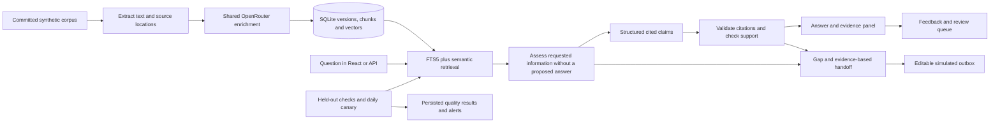

# Architecture and decisions

## Ingestion and provenance

Deterministic extractors preserve author/attendee and date metadata before any model call. Word extraction follows paragraphs and tables in document order. Presentations preserve slide, shape, table, and notes locations. Workbooks retain sheet names and cell ranges, include header context, and identify formulas whose cached results are unavailable. The service does not calculate a missing result.

Legacy Office files are converted in a temporary directory with a separate LibreOffice user profile, a deadline, and output verification. Originals remain unchanged and are archived by document version. Word locators after conversion identify normalized structural positions, not original page numbers.

Ingestion is a CLI operation, not an unrestricted browser upload endpoint. This keeps the local take-home small and avoids adding an upload/job subsystem. It processes each file independently and reports failure instead of silently omitting a format. The same enrichment prompt applies to all formats. Source identities never come from the model.

SQLite stores active and historical document versions, location-bearing chunks, cached embeddings, query snapshots, feedback, review items, outbox entries, operational events, and evaluations. Source content hashes and a processing-profile fingerprint determine whether ingestion can be skipped. A new active version does not rewrite previous answers. Archived originals make old citation downloads work even when the source folder changes.

Extraction operates on a byte snapshot, so the text and archived hash cannot diverge if a source changes during processing. Publishing uses a serialized compare-and-replace: a slower stale ingestion cannot overwrite a newer version. Author/date headers are read only from the leading metadata region; an `Author:` string in body text is not promoted to attribution. Explicit folder ingestion retires missing paths after successful discovery, preserving historical rows. Linked directories are not followed. Extraction limits are 32 MiB per source, 64 MiB expanded OOXML, 10,000 archive parts, and 200,000 declared spreadsheet cells.

## Retrieval and grounded answers

SQLite FTS5 lexical ranking and exact cosine similarity over cached vectors are merged using reciprocal-rank fusion. Exact vector search is sufficient for this 24-document dataset and removes a separate vector-service dependency. Queries use the same configured embedding model and dimensions as the corpus; a changed model requires re-ingestion.

Before ranking, the application screens all active chunks of every document for recognizable AI control instructions, role impersonation, and verifier manipulation. Any flagged document is excluded as a whole from question-time model context, citations, and routing, with a visible health warning; its original remains inspectable. This boundary was added after a live source attack fooled both generator and reviewer. Unicode/HTML normalization catches simple obfuscations, but unflagged content is not proven trustworthy. Convincing fabricated business facts and unseen attacks remain a limitation, and legitimate documents discussing prompt syntax may need review. Invalid cached vectors are rebuilt; invalid stored vectors produce an operational error, not an apparent knowledge gap. Scaled cosine avoids floating-point overflow and underflow.

Before generation, an answer-blind assessment decomposes the question and checks the evidence for each requested component. This prevents a fluent proposed answer from anchoring the coverage judgment. The backend derives answer status from those components: a correctly quoted statement that a requested value is unknown does not become an answered question.

The generation request includes only retrieved passages with stable chunk IDs and trusted attribution metadata. Each immutable chunk receives a deterministic catalog of contiguous source spans. The model returns schema-constrained claims selecting chunk and span IDs; the backend rejects invented IDs and resolves quotations directly from stored source text. This avoids asking the model to reproduce exact quotations. A separate model call reviews whether each cited passage supports the entire claim and whether requested information is omitted. It receives each claim's cited context, without a pool of uncited coverage values. One bounded repair can correct a rejected or incomplete draft; remaining failed claims are omitted. Incomplete evidence or unresolved contradictions produces partial/abstaining output. A false-positive verifier judgment remains a limitation documented by the adversarial review.

Generation and enrichment default to GPT-4.1-mini. Coverage and support review use separately configurable GPT-4.1, selected after live tests exposed unreliable absence and scope judgments with the smaller model. Separating models and withholding the draft from coverage review reduces anchoring; neither reviewer is independent ground truth. Golden evaluation cases and visible source evidence are additional checks. The service uses categorical answer states rather than presenting an uncalibrated model confidence percentage.

Routing recipients are constructed from the relevant source authors and attendees. Deterministic ranking favors explicit named responsibility and question-relevant body passages over document frequency. Each suggestion includes matching source content and evidence IDs; document metadata headers do not substitute for a supporting excerpt. Unrelated queries cannot invent an expert; the user can choose a recipient manually. Editing a recipient is a user action, preserved with the originating query rather than represented as a sourced assertion.

## Feedback and operational behavior

The review queue contains both automatic knowledge gaps and explicit user rejections/corrections. Items retain the original query and answer snapshot. Resolving a review item requires a note and never automatically promotes a correction into authoritative source content.

The outbox persists recipient, subject, body, query, and evidence references. Its status is always `simulated`. No connector, SMTP integration, or real delivery is hidden behind that button.

OpenRouter calls use a shared HTTPX client, bounded retries for transient failures, strict local response validation, and an overall operation deadline. Provider credentials, account-credit failures, unavailable models, and conversion failures remain operational errors rather than knowledge gaps. Provider telemetry stores operational metadata without keys or raw HTTP responses. Validated coverage assessments are retained separately as local SQLite events linked by query ID, so developers can inspect why a response abstained or appeared complete.

FastAPI serves the built React assets and API from one origin. The default host is `127.0.0.1`. Authentication, multi-tenant permissions, real email, OCR, a background worker system, and public hosting are intentionally outside this local evaluation build.

## Configuration

| Variable | Default or purpose |
| --- | --- |
| `OPENROUTER_API_KEY` | Required server-side credential |
| `OPENROUTER_MODEL` | `openai/gpt-4.1-mini` |
| `OPENROUTER_REVIEW_MODEL` | `openai/gpt-4.1`; answer-blind coverage and claim verification |
| `OPENROUTER_EMBEDDING_MODEL` | `openai/text-embedding-3-small` |
| `SOFFICE_PATH` | Optional explicit LibreOffice executable |
| `DATA_DIR` | `.runtime`, containing the local database and immutable originals |
| `CORPUS_DIR` | `data/corpus` |
| `EVALUATION_PATH` | `data/evaluation.json` |
| `DAILY_EVALUATION` | `true`; set `false` to disable recurring live canaries |
| `OPENROUTER_API_KEY_ENV` | Optional alternate key-variable name mapped by the startup scripts |

The checked-in `.env.example` has no secrets. Environment variables take precedence over `.env` configuration. Runtime artifacts are excluded from the submission.
